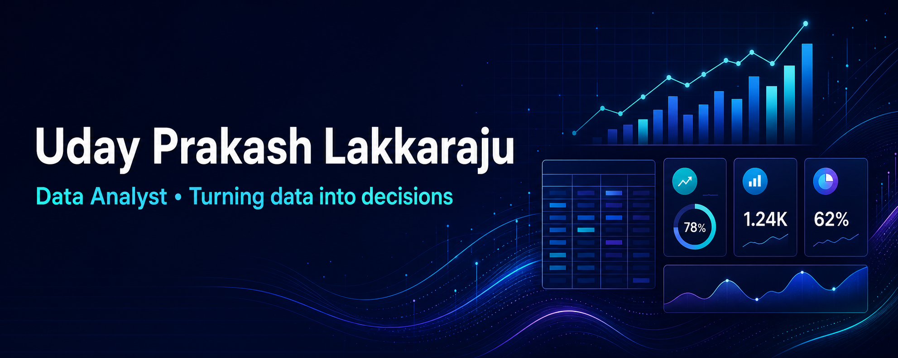
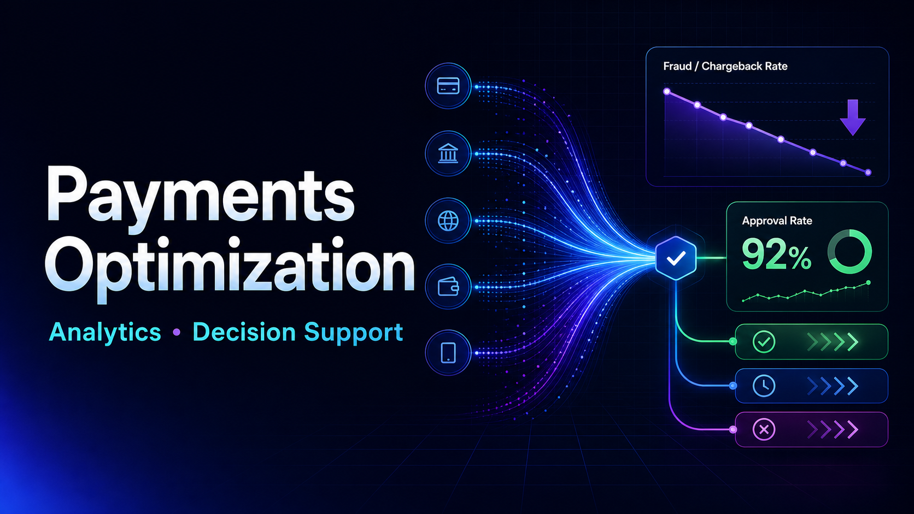
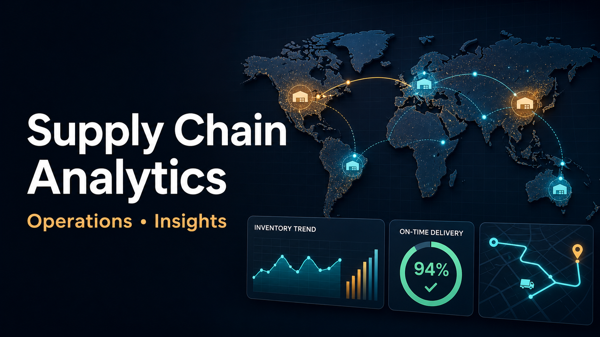
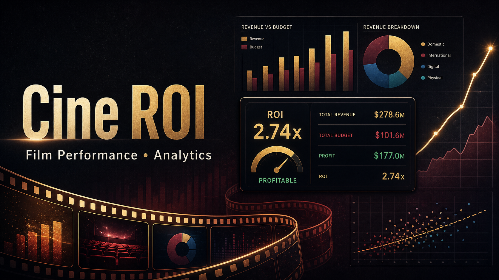
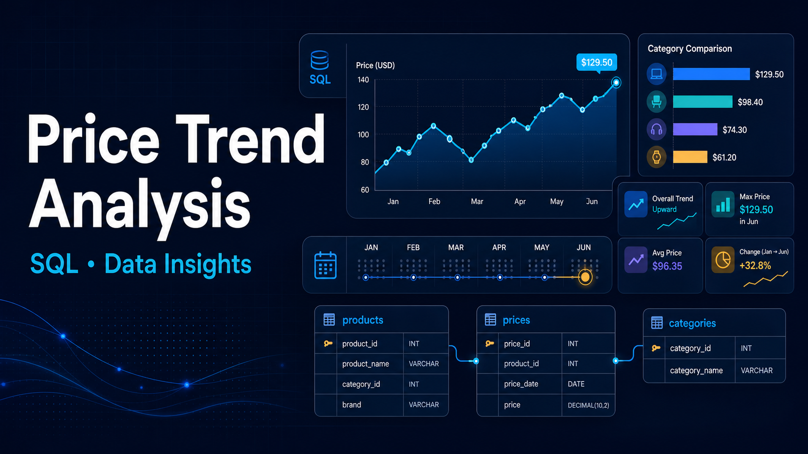

 

## About Me

I’m **Uday**, an aspiring Data Analyst who is most interested in the decision behind the dashboard. I like taking a business problem that feels broad—lost payments, late deliveries, uncertain content investments, changing product prices—and narrowing it into the few signals a team can actually act on.

In my **Payments Optimization** project, I examine decline patterns, retry opportunities, and fraud-review prioritization. In **Supply Chain Analytics**, I focus on delivery performance and operational risk. My **Cine ROI** and **Price Trend Analysis** projects extend that same approach to investment decisions and product pricing. I use **SQL, Python, Excel, Power BI, and BigQuery** to move from raw data to a clear business story—not just a chart.

`SQL` &nbsp; `Python` &nbsp; `Power BI` &nbsp; `Excel` &nbsp; `BigQuery` &nbsp; `Pandas` &nbsp; `Git`

## Featured Projects

  
  
    
  
  

 

| Focus | What I Build |
|:--|:--|
| 💳 **Payments Optimization** | Analysis for payment declines, retry recovery, and fraud-review prioritization |
| 🚚 **Supply Chain Analytics** | Decision support for operational risk and delivery performance |
| 🎬 **Cine ROI** | Revenue, budget, and investment-performance analysis for film content |
| 📈 **Price Trend Analysis** | SQL-driven product pricing and trend analysis |

## GitHub Activity

  
  
   
  

---

  <i>Open to Data Analyst, BI Analyst, Operations Analyst, and Analytics opportunities.</i>

